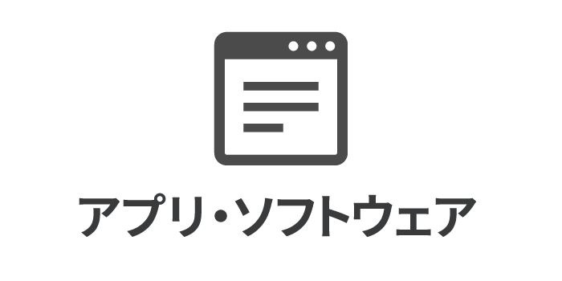

こんにちは！ まなびシステム（ [@manabisystem](https://twitter.com/manabisystem/) ）です。

みなさんがパソコンを使うということは、何らかのソフトウェアを使うということです。ワードであるとか、ホームページ閲覧ソフトであるとか。それでは「フリーソフト」をご存知でしょうか？

今回は「フリーソフト」とは何なのか、ということをご説明いたします。

目次
- [フリーソフトとは？](#フリーソフトとは？)
- [開発や配布の中止も](#開発や配布の中止も)
- [フリーソフトでの失敗](#フリーソフトでの失敗)
- [あとがき](#あとがき)

## フリーソフトとは？

フリーソフトとは、無償で提供されてるソフトウェアです。主に作成者のご厚意により配布され、ユーザーは使うことができます。とてもありがたいものですね。

ちなみに、「フリーソフト」は、「フリーソフトウェア」の略称ではありません。「フリーソフトウェア」とは、「自由なソフトウェア」という意味です。フリーソフトウェアは、その設計図が公開され、それらを改変したり、利用したりすることが認められたものです。ここでは、フリーソフトウェアについて、これ以上触れないこととします。

フリーソフトは、ワードなど高機能なソフトウェアに比べると機能が少なめです。これは個人が開発しているからというのもあるでしょう。しかし、作者の方が必要に迫られて開発されたものであったりするので、多くの人に受け入れられる可能性があります。

### フリーソフトのメリット

フリーソフトのメリットは、無料で提供されていることです。公開すると多くの人たちが利用しますので、そのソフトの不具合も発見されやすく、修正もしてもらいやすくなります。ユーザーの要望も受け入れてもらいやすいかもしれません。

### フリーソフトのデメリット

フリーソフトのデメリットは、その利用はユーザーの自己責任ということです。つまり、ユーザーが利用することによる損害は一切保証されません。こうした損害のリスクは、企業が作成するソフトウェアより高いのかもしれません。ソフトウェアの設計図が公開されない場合がほとんどなので、どのような仕組みで動いているのかもわかりません。これは場合によっては大きな問題になります。この点は注意しておいたほうがいいでしょう。

しかし、私は長年、フリーソフトやフリーソフトウェアを利用させていただいていますが、こうしたトラブルに出くわしたことはありません。むしろ、Windowsの更新による不具合に出くわしたことがあるぐらいです。

## 開発や配布の中止も

そんな便利なフリーソフトですが、個人が開発してるがゆえにその作成者の方の事情から、突然開発を中止されたり、配布を停止したりすることがあります。

企業の開発したソフトウェアでもそういう例はもちろんありますが、フリーソフトはそこまでユーザーに責任を負うことはありません。

## フリーソフトでの失敗

私は長年、さまざまなフリーソフトを使わせていただいています。パソコンで作業することが多いので、欠かせないフリーソフトはあります。

ある時、パソコンが突然故障しました。それらのフリーソフトが使えなくなりました。作者のページで再び取得させていただこうと思い、ホームページを開こうとすると、そのホームページがなくなっていたということもありました。こうなるともうそのフリーソフトは使えないわけです。

こういうことがあり、本当に必要なフリーソフトは、保存しておくようにしています。

## あとがき

いかがでしたでしょうか？

パソコンは便利なものですが、フリーソフトを使うとさらに便利になる可能性があります。これを機会に導入を検討されてみてはいかがでしょうか？

フリーソフトをまだ使ったことない方もおられるかもしれません。そういう方はこれを機会にフリーソフトを扱っている専門のホームページなどをご覧になってみてはいかがでしょうか？

ここでは、窓の杜([https://forest.watch.impress.co.jp/](https://forest.watch.impress.co.jp/))を紹介させていただきます。かなり昔からあるフリーソフトの紹介サイトです。長年の蓄積もありますので、ここのフリーソフトを利用するのは問題ないかと思います。

どのような機能を持つソフトウェアがあるのか知ることができて楽しいですよ。

フリーソフトを取得するには、「ダウンロード」や「インストール」など、新しい理解が必要になります。まずはそれらについてご理解の上、試してみてください。

以上です。読んでいただきありがとうございました。
