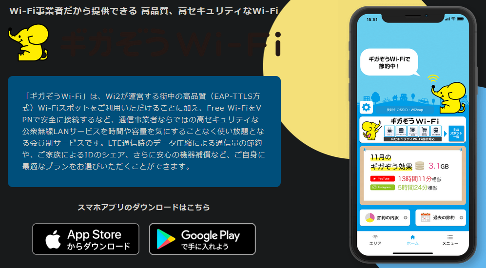
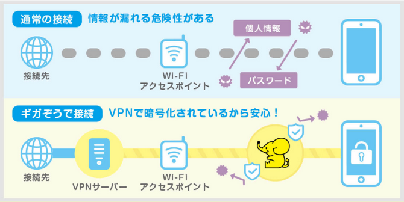

こんにちは！ まなびシステム（ [@manabisystem](https://twitter.com/manabisystem/) ）です。

スマホの月額料金でお悩みではありませんか？

- 月額料金が高いけど、プランを変更できない…
- 携帯会社を変更したらメールアドレス変わるからみんなにお知らせしなきゃいけないから面倒…
- 格安スマホ？　名前は聞いたことあるけど、なんか心配…

今回は、このような悩みを少しだけ解消する方法をご説明いたします。使い方によっては大幅に料金を抑えることも可能です。

目次
- [公衆無線LANとは](#公衆無線LANとは)
- [有料無線LANサービス「ギガぞうWi-Fi」を使う](#有料無線LANサービス「ギガぞうWi-Fi」を使う)
- [あとがき](#あとがき)

## 公衆無線LANとは

公衆無線LANとは、無線LANという仕組みを利用してインターネットへの接続を提供するサービスです。Wi-Fiという名称が使われることもあります。

公衆無線LANを利用することで、スマホの通信量を気にする必要はなくなります。

駅やカフェ、コンビニ、ファストフード店などさまざまなところで提供されています。これらは無線LANスポットやWi-Fiスポットと呼ばれます。無料で提供されていることがほとんどです。カフェなどの場合ですと、入り口にシールが貼られていたりします。

スマホをお持ちの方で、ドコモ、au、ソフトバンクの利用者であれば、各社が提供するサービスの無線LANスポットに入ることで自動的に切り替わります。

公衆無線LANサービスの提供地域を知ることで、できるだけその地域内で利用することを心がければかなり月額の料金プランを下げることも可能です。

実際に私は、料金の安いプランに加入しています。大量の通信を必要とするときには、サービス地域を把握してそこで利用することを心がけています。

### 公衆無線LANのデメリット

いいことずくめにみえる公衆無線LANですが、デメリットもあります。それは安全面です。通信の内容が第三者に見られてしまう可能性があります。ですから、本来ですとそのまま利用するべきではありません。

ちなみに、ドコモ、au、ソフトバンクなど契約する企業が提供する公衆無線LANは、暗号化の処理がされていますので安全とされています。

## 有料無線LANサービス「ギガぞうWi-Fi」を使う

では、どうすればいいのでしょうか？

1つの提案として、私は有料無線LANサービスの加入をおすすめします。「ギガぞうWi-Fi」というサービスです。ギガぞうWi-Fiの「スマホ専用プラン」ですと、月額182円(税別)で利用できます。(2020年05月12日現在)

上の図は、ギガぞうWi-Fiが提供している無線LANスポットの一部です。

ギガぞうWi-Fiは、公衆無線LANのデメリットである安全面をカバーしてくれます。通信の内容を暗号化してくれるということです。

ギガぞうWi-Fiのアプリを取得して、ユーザー登録をします。クレジットカード番号などを入力すれば、あとはギガぞうWi-Fiが提供する無線LANスポットの地域に入りますと自動的にギガぞうのサービスに切り替わります。

### 公衆無線LANでの暗号化

ギガぞうWi-Fiは、ギガぞうWi-Fiが提供する無線LANスポットを利用するのが基本ですが、公衆無線LANサービスの暗号化をしてくれる機能があります。

前述したとおり、通常の公衆無線LANサービスでは通信内容が第三者に見られてしまうわけですが、ギガぞうWi-Fiアプリを導入していると、公衆無線LANサービスに切り替わった際、自動的に暗号化してくれるのです。

この機能はとても便利で、たくさんある無料の公衆無線LANサービスを利用しやすくします。この機能を手軽に導入できるだけでも、ギガぞうWi-Fiのメリットがあるとさえ思えます。

### ギガぞうWi-Fiの使用感

前述したとおり、私はギガぞうWi-Fiを利用して通信量を抑えることができています。特にトラブルもありません。しかし、通信状態はその地域の環境に依存する部分もあり、実際に利用者の環境で使用してみないとわかりません。

### ギガぞうWi-Fiのデメリット

ギガぞうWi-Fiを使うことで公衆無線LANのデメリットは解消されます。しかし、ギガぞうWi-Fiにもデメリットはあります。

#### 通信速度の低下

上の図にありますように、ギガぞうWi-Fiは通信の間に介在されるサービスです。間にクッションが入るのでそこの品質いかんでは通信速度が遅くなる可能性があります。

#### 通信記録の扱いは不明瞭

通信の間に介在されるサービスということで、ギガぞうWi-Fi側に通信状況が筒抜けになります。こうした通信記録の扱いがどうなっているのか気になる場合は、利用を中止したほうがいいかもしれません。

ちなみに海外の類似サービスには、通信記録を保存していないことを明記しているサービスもあるようです。

## あとがき

いかがでしたでしょうか？

月額200円程度で、数千円の通信量が抑えられたらありがたいですよね。

ギガぞうWi-Fiのスマホ専用プランでの同時接続は1台に限られています。しかしその他にもプランがありますので、詳しくお知りになりたい方は、ギガぞうWi-Fiのホームページ([https://wi2.co.jp/jp/](https://wi2.co.jp/jp/))をご覧になってみてください。

以上です。読んでいただきありがとうございました。
