こんにちは！ まなびシステム（ [@manabisystem](https://twitter.com/manabisystem/) ）です。

ブログの書くのであれば、できるだけ多くの人に読んでもらいたいものです。しかしブログの更新情報をいちいち自分で投稿していたら面倒ですよね。

この記事では、ブログを更新すると自動的にTwitterへ投稿する方法をご説明します。

事前にブログとTwitterはすでに利用しているという前提で話を進めさせていただきます。

目次
- [IFTTT（イフト）とは](#IFTTT（イフト）とは)
- [アカウント作成](#アカウント作成)
- [ブログとTwitterを連携させる](#ブログとTwitterを連携させる)
- [あとがき](#あとがき)

## IFTTT（イフト）とは

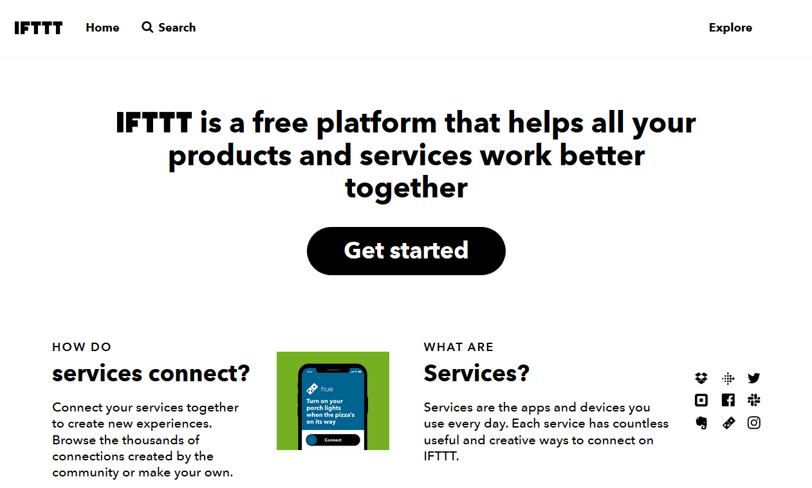

さまざまなWebサービス（Facebook、Twitter、Evernoteなど）を互いに連携させることのできるサービスです。

- Twitterの「いいね」をEvernoteに投稿する
- ブログを更新したらTwitterに投稿する

ユーザーが作成したものを共有して利用させていただくことができるので、数え切れないほどの連携数になっています。

だだし、どのWebサービスでも使えるというわけではないですし、あるWebサービスに対応していたとしても望みの機能が実現できるというわけではありません。

## アカウント作成

IFTTTのサービスを利用するにはアカウントの作成が必要になります。ここではその方法をご紹介いたします。

### 1.IFFTTのホームページを表示

ホームページ閲覧ソフトでを表示する。

### 2.メールアドレスの入力
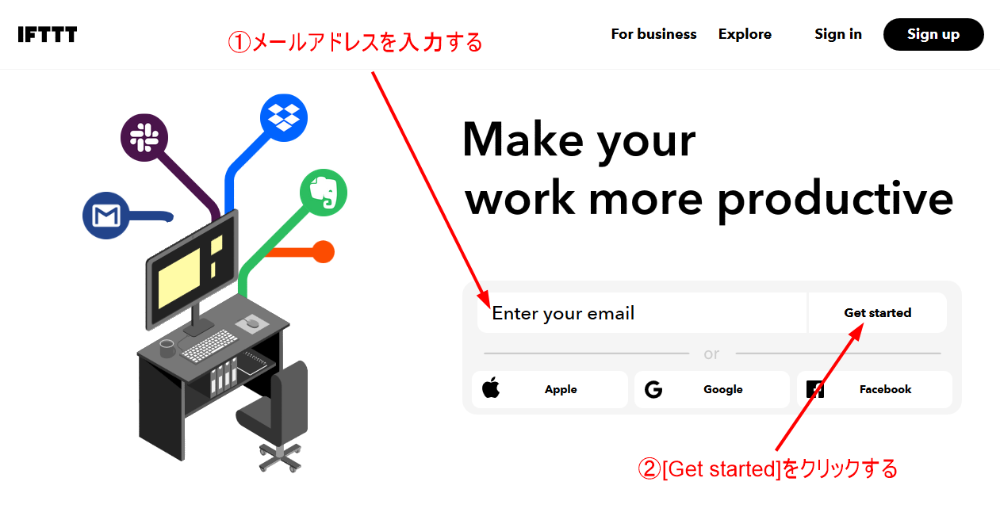

### 3.パスワードを決めて入力
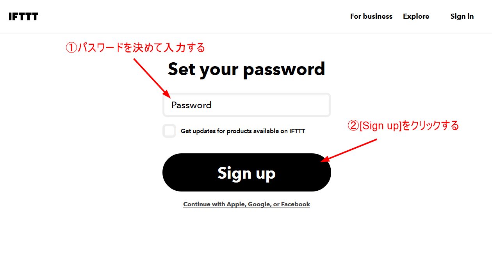

### 4.おすすめ画面をスキップ
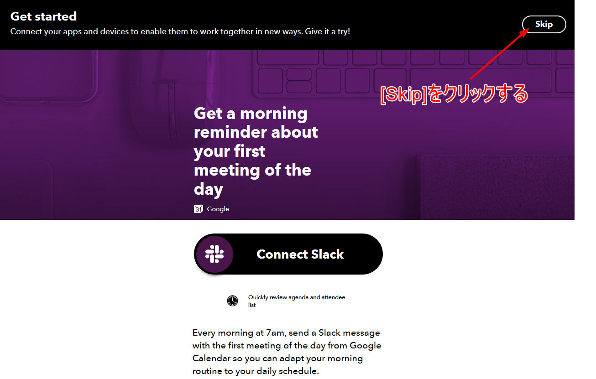

### 5.作成完了

## ブログとTwitterを連携させる

### 1.メニューからアプレット作成

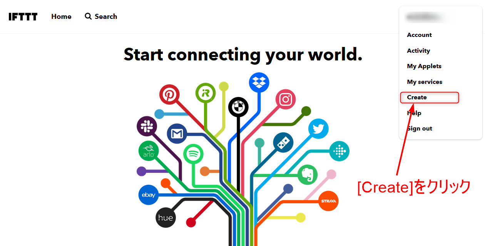

### 2.「RSS」を登録

「＋」をクリックしてサービスを選択します。
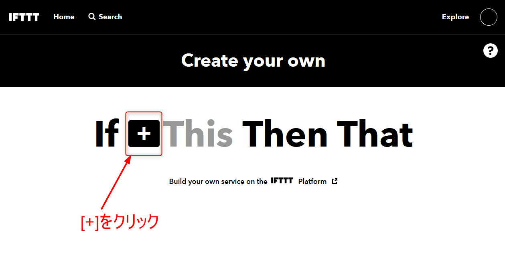

「RSS」を検索して「RSS Feed」サービスを表示します。
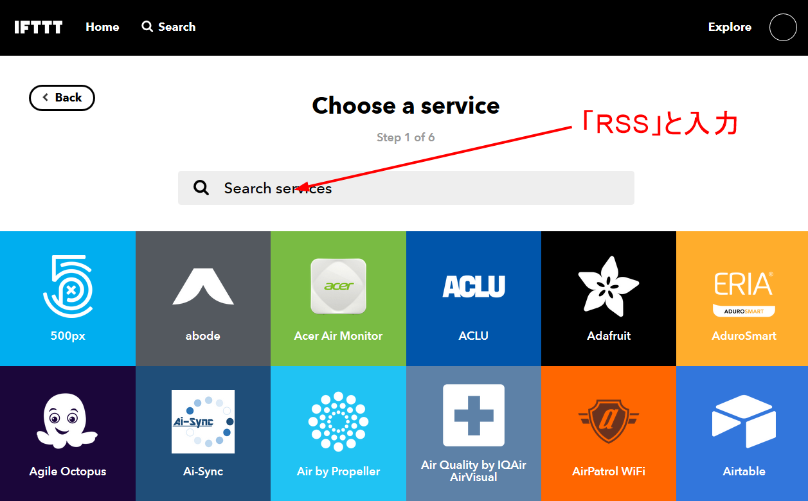

「RSS Feed」を選択します。
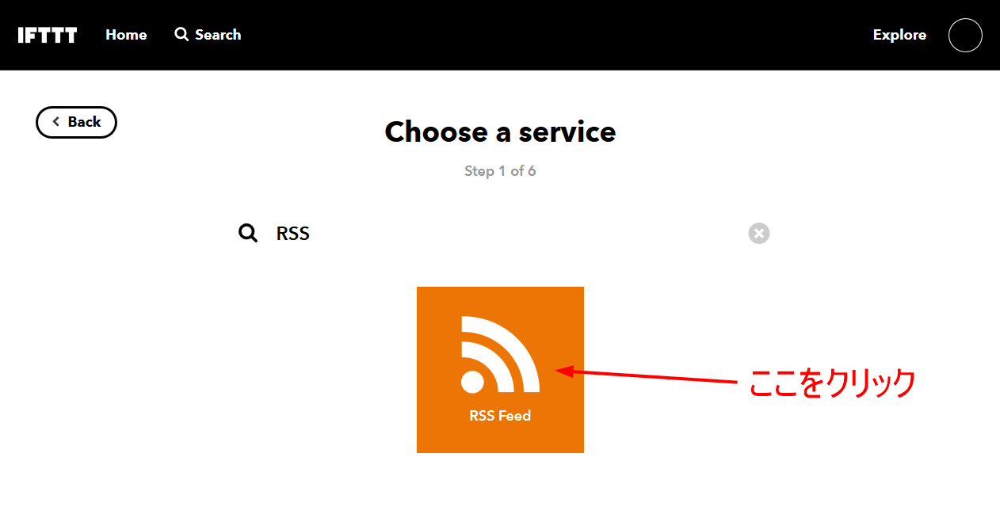

「New Feed Item」を選択します。
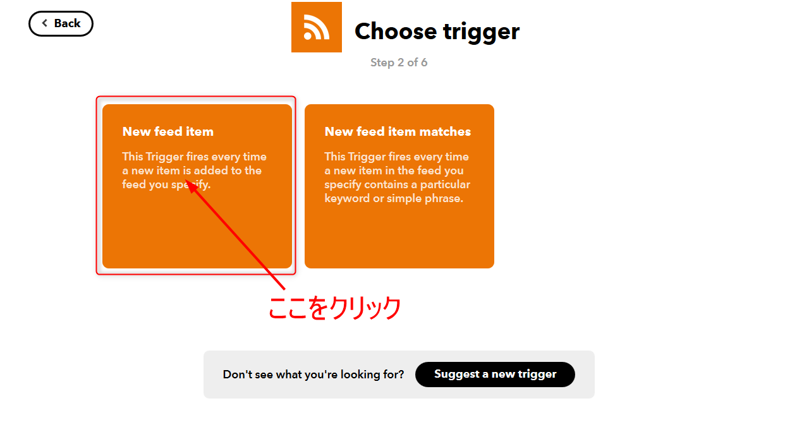

「Feed URL」に、ブログの更新情報ファイル(RSSやフィード)のアドレスを入力します。
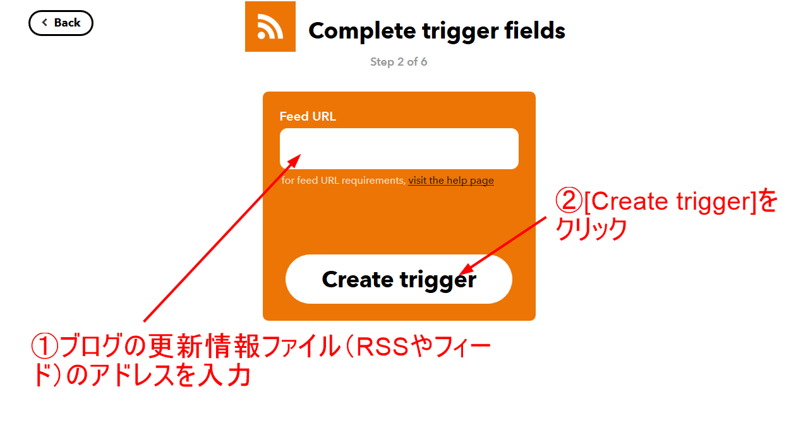

オレンジのマークになっていることを確認して、「＋」を選択します。
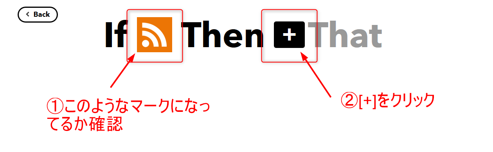

### 3.「Twitter」を登録

サービスを選択します。「Twitter」を検索します。
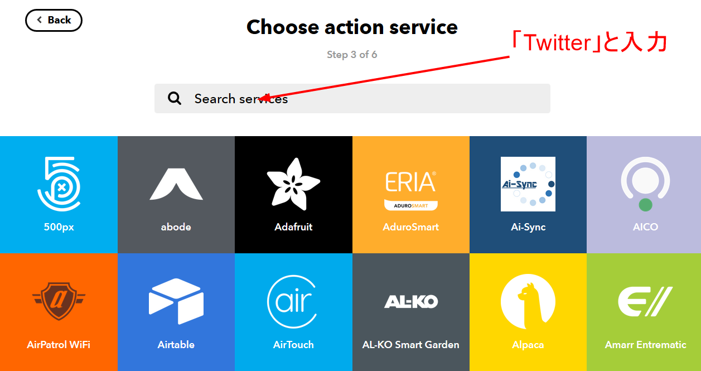

「Twitter」を検索してください。
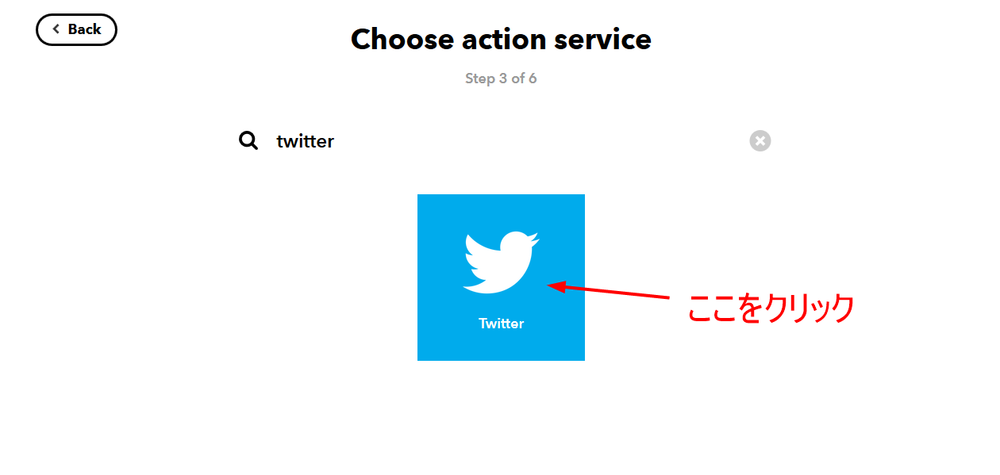

「Post a tweet」を選択します。
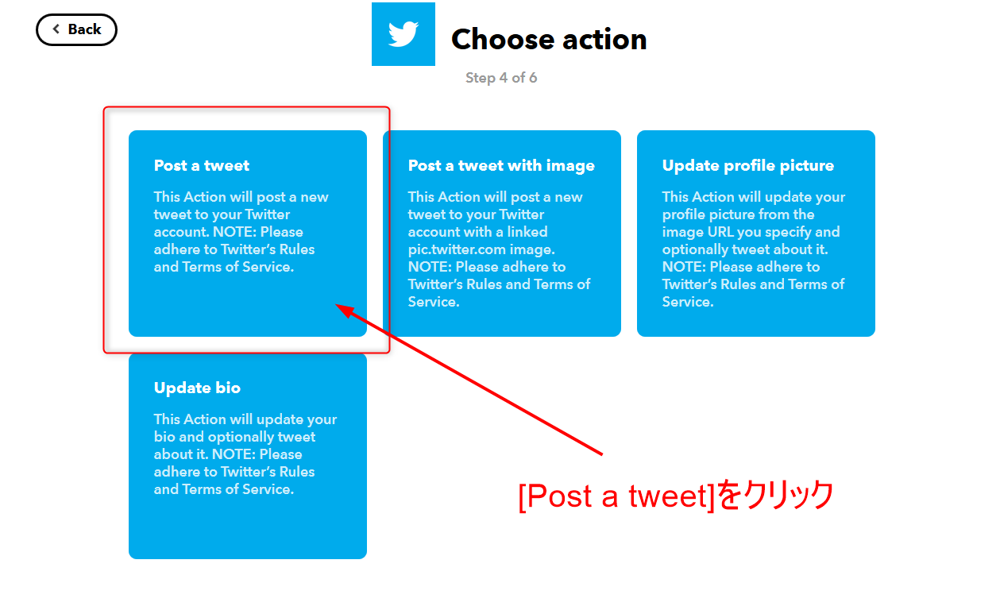

「Tweet text」に、Twitterに投稿したい文章を入力してください。「EntryTitle」や「EntryUrl」は消さないようにしてください。
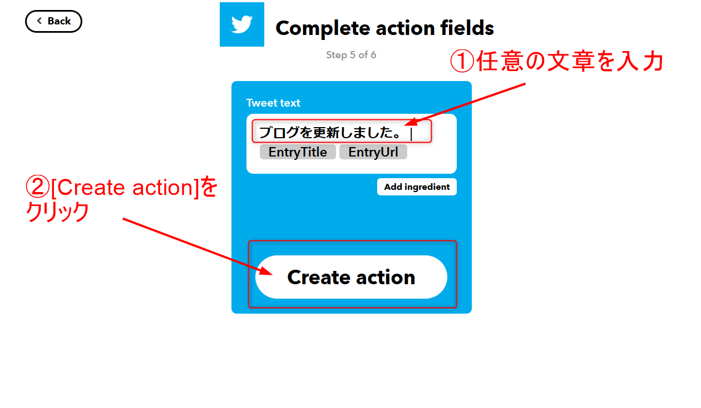

### 4.設定完了

「Finish」を選択すると設定完了です。
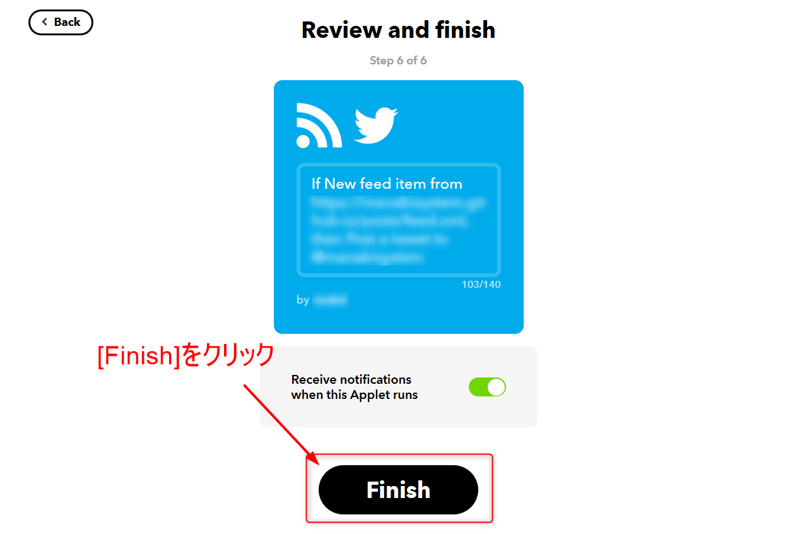

## あとがき

今回はTwitterにブログの更新情報を自動で投稿する方法をご説明いたしました。

他にもいろいろなサービス同士を連携させることができます。最近ではAIスピーカーとの連携も出てきているようです。

どのようなことができるのか気になる方は、ご利用のサービスを検索してみてはいかがでしょうか。

- [IFTTT（イフト）](https://ifttt.com/)

以上です。読んでいただきありがとうございました。
