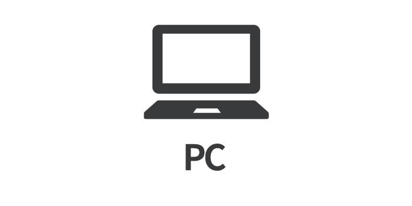
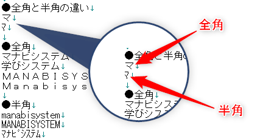
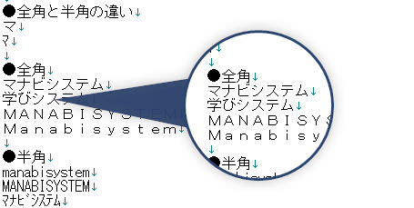
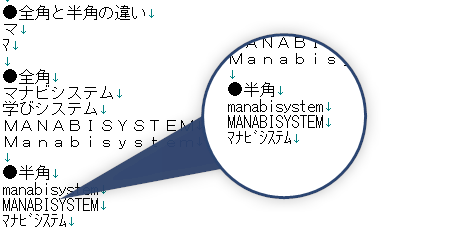
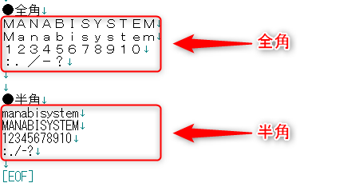
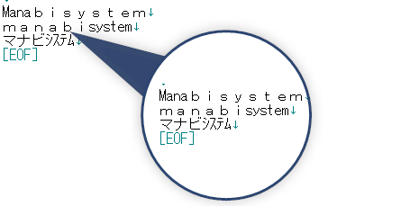
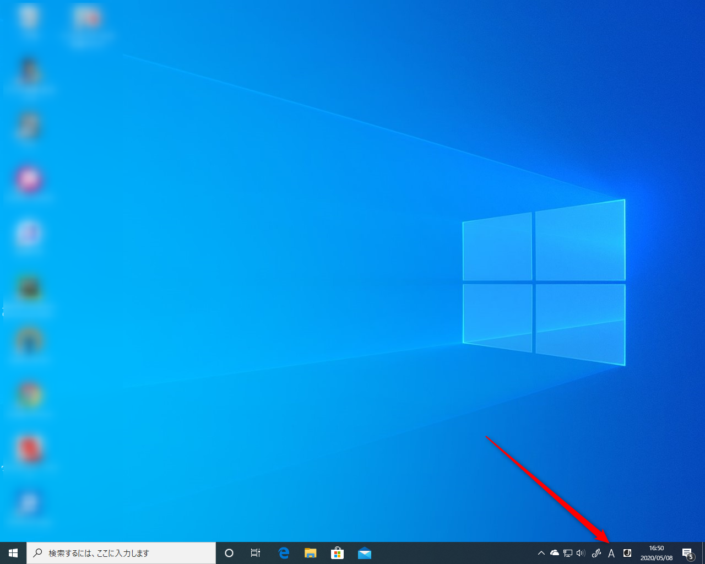
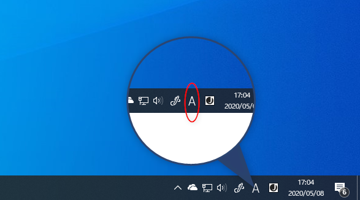
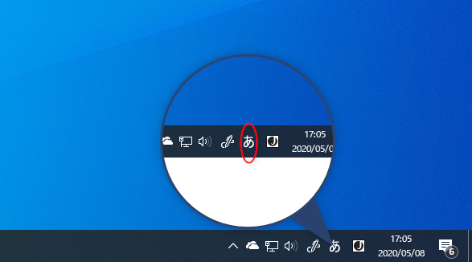

こんにちは！ まなびシステム（ [@manabisystem](https://twitter.com/manabisystem/) ）です。

あなたがコンピューターに入力している文字は、「半角」と「全角」に区別されることをご存知ですか？

この記事では、「半角」と「全角」とはそもそも何なのか、そしてその確認方法をWindows 10を例にご説明いたします。

目次
- [半角と全角とは](#半角と全角とは)
- [数字・記号・英語は、半角と全角がある](#数字・記号・英語は、半角と全角がある)
- [どのような時に問題になるか](#どのような時に問題になるか)
- [Windowsでの半角と全角の確認方法](#Windowsでの半角と全角の確認方法)
- [あとがき](#あとがき)

## 半角と全角とは

あなたは、文字を入力する時にローマ字を入力して、ひらがなを表示し、漢字に変換していると思います。

この文字１つ１つの表示は「全角」と呼びます。

逆に「半角」とは、この「全角」を基準として、半分の文字のことを呼びます。

次の画像では、「マ」の文字と「ﾏ」の文字のサイズの違いがおわかりいただけますでしょうか？

### 全角

日本語やひらがなに「半角」は、ありません。すべて「全角」です。

### 半角

「半角」が存在するのは、英語、数字、記号、カタカナなどです。

## 数字・記号・英語は、半角と全角がある

「全角」と「半角」の違いは、主に「数字」「記号」「英語」「カタカナ」です。

なぜならこれらは「全角」でも「半角」でも存在するからです。

こちらは同じ文字を「半角」と「全角」で表示させたものです。表示の違いがおわかりいただけると思います。

## どのような時に問題になるか

### 半角と全角が混在した時

「半角」と「全角」が混在するととても文字が読みにくくなります。

以下の文字はとても読みにくくありませんか？

### IDやパスワードの入力の時

IDやパスワードの入力は、「半角」が基本です。

「全角」で入力してしまうと、コンピューターが思い通りの動作をしません。

その他にも、ホームページアドレスの入力やメールアドレスの入力も「半角」が基本です。

## Windowsでの半角と全角の確認方法

ここでは、Windows 10で、現在の文字入力の状態がどうなっているかを確認する方法をご説明いたします。

### マイクロソフトIMEの場合

ここでは「マイクロソフトIME」というWindows 10に標準で導入されている文字入力ソフトウェアでの設定をご紹介いたします。

Windows 10を購入して、特に設定を変更したり、新しい文字入力ソフトウェアを導入してない場合は、マイクロソフト社製のマイクロソフトIMEが導入されています。

確認方法は、ウィンドウズの画面右下を見ていただけるとわかります。

「半角」の場合は、以下のような表示になっています。

「全角」の場合は、以下のような表示になっています。

## あとがき

いかがでしたでしょうか？

コンピューターを利用する上で文字の入力は欠かせません。

老眼で文字が見にくい方も、しっかりと確認することをおすすめいたします。

これだけでも、メールの送信やアカウントを使ったログインでトラブルになることを減らせます。

ぜひこの機会に意識する習慣をつけていただければと思います。

以上です。読んでいただきありがとうございました。
