こんにちは！ まなびシステム（ [@manabisystem](https://twitter.com/manabisystem/) ）です。

私は「Duolingo(デュオリンゴ)」というサービスを利用して英語を勉強しています。

今回はDuolingoについてのご紹介と簡単な進め方についてご説明いたします。

目次
- [Duolingo(デュオリンゴ)とは](#Duolingo(デュオリンゴ)とは)
- [Duolingoのアカウント作成](#Duolingoのアカウント作成)
- [Duolingoの進め方](#Duolingoの進め方)
- [Duolingoの特徴](#Duolingoの特徴)
- [Duolingoのメリット](#Duolingoのメリット)
- [Duolingoのデメリット](#Duolingoのデメリット)
- [あとがき](#あとがき)

## Duolingo(デュオリンゴ)とは

2011年に始まった言語教育サービスです。内容によって有料と無料があります。2016年4月までに59言語に対応し、現在もさらにいくつかの言語を開発中です。

私はその中で英語の無料サービスを利用させていただいています。ゲーム感覚で進められて、分量も自分で決められます。また毎日継続するような仕組みがあったり、コミュニティでは利用者の方々と会話をすることも可能です。

Duolingoは、ホームページ版、アイフォン版、アンドロイド版があります。

## Duolingoのアカウント作成

Duolingoでは、記録を残すためにアカウントを作成する必要があります。ここでは、英語の学習をすることを例にアカウントの作成方法をご説明いたします。

### 1.「さあ、始めましょう」をクリック

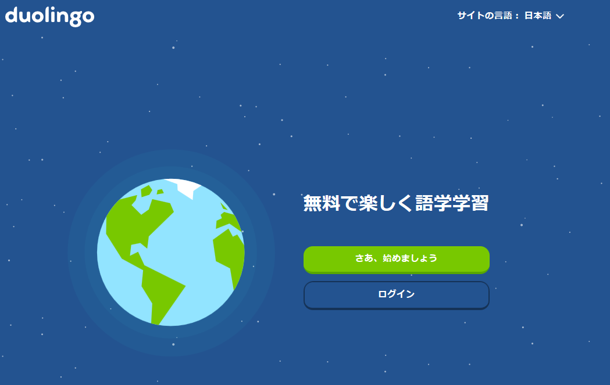

### 2. 「英語」をクリック
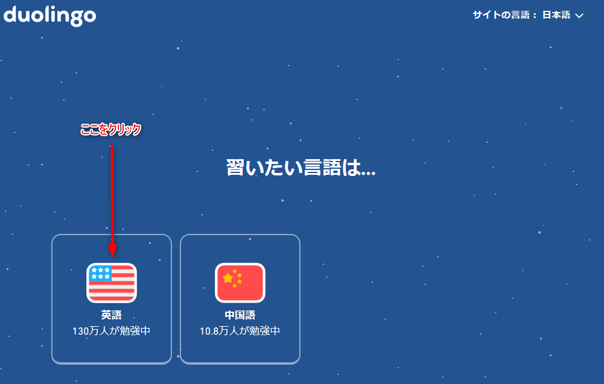

### 3.学習目的を選択し、「次へ」をクリック
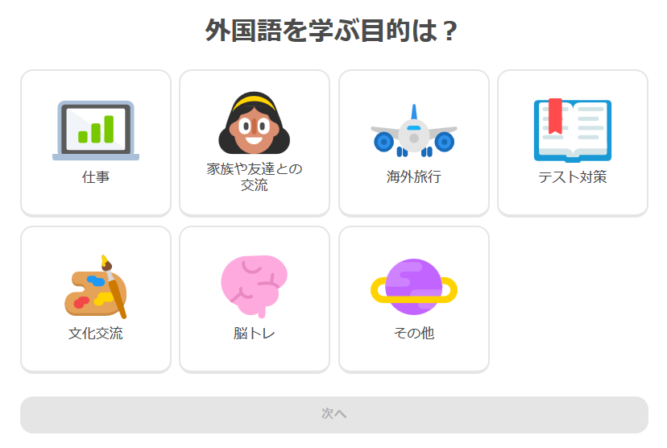

### 4.「アカウントを作る（無料）」をクリック
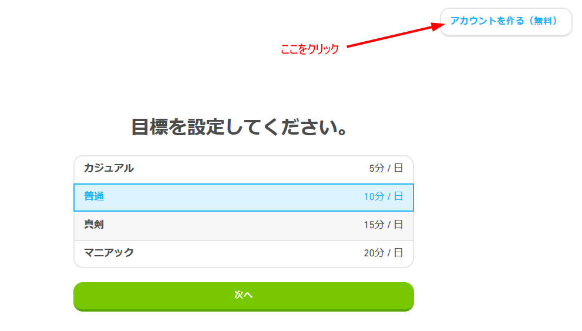

### 5.それぞれの項目を入力して「アカウント作成（無料）」をクリック
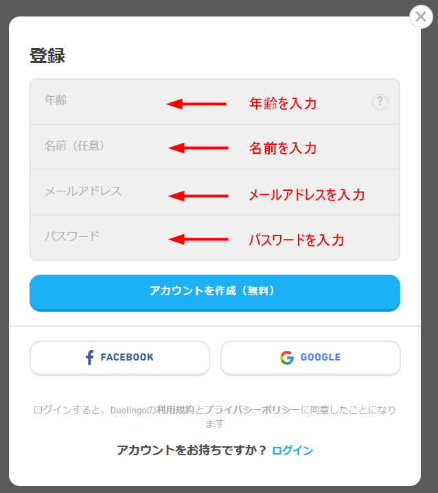

以上で作成が完了します。

## Duolingoの進め方

ここでは私が普段やっているDuolingoの進め方を簡単にご説明いたします。

Duolingoの基本は、以下のような出題に繰り返し答えていくことです。

 - 設問の項目を選択する
 - 音声で聞いた英文を日本語にする
 - 日本語の文章を英語にする

間違えるとしつこく何度もできるまで出題されます。操作的に難しいことはありません。1回レッスンの分量は少ないので、数分のレッスンだけすることも、いくつものレッスンをやることも可能です。

レッスンは英文法の分類が基本ですが、普段使うようなジャンルの単語を集中的にレッスンしてくれるものもあります。
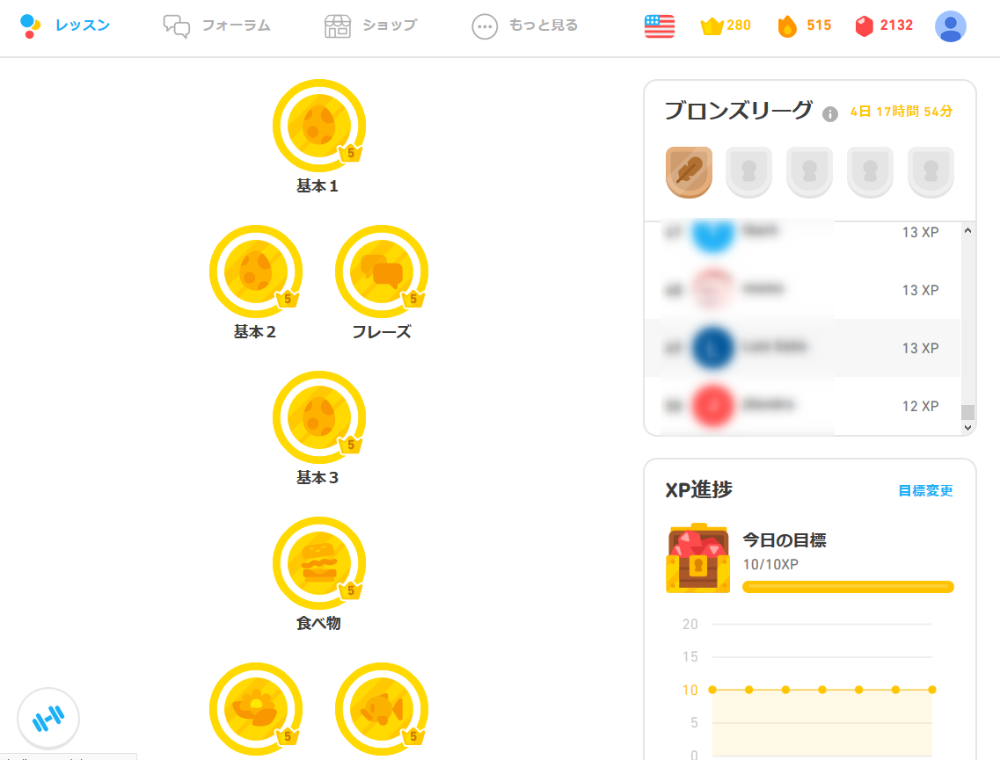

### 設問の項目を選択する
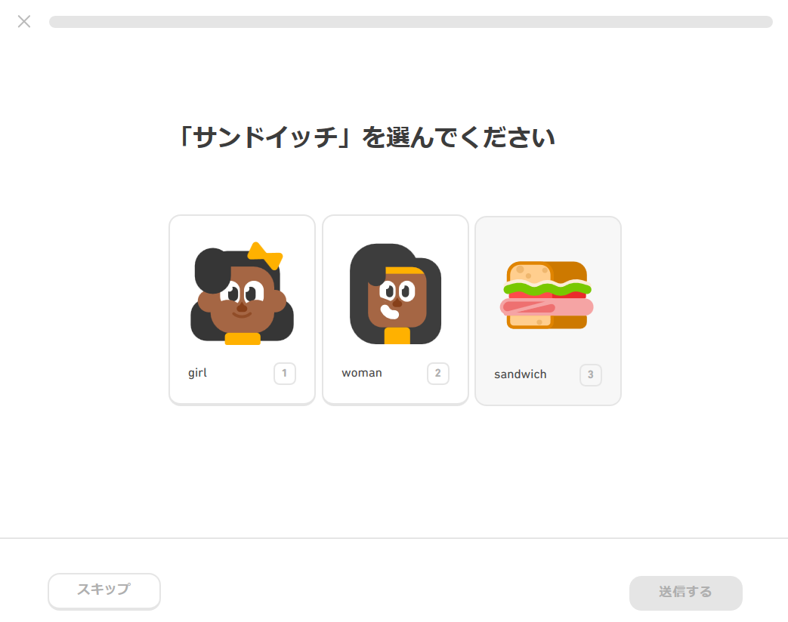

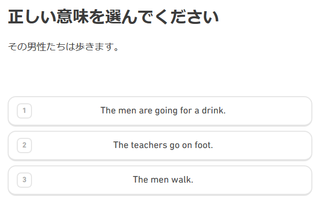

### 音声で聞いた英文を日本語にする
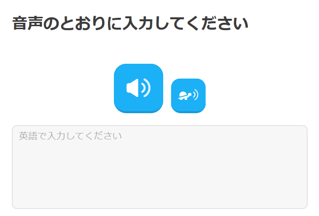

### 日本語の文章を英語にする
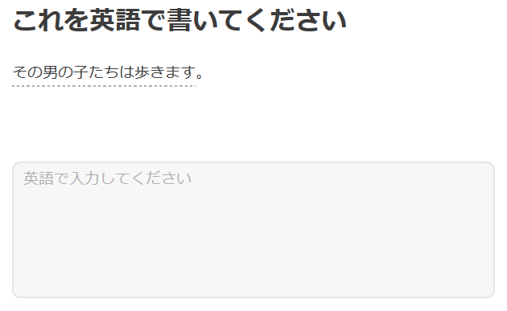

## Duolingoの特徴

### Duolingo通貨「リンゴット」

Duolingoには「リンゴット」というDuolingo内の通貨があります。リンゴットを使うことで便利なアイテムを購入できます。
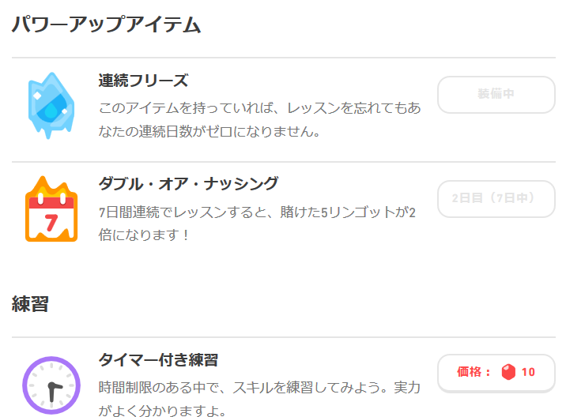

### ランキングシステム

レッスンをクリアーすると「XP」というポイントがもらえます。そのポイントは利用者のランキングになります。ホーム画面に表示されます。

XPポイントによって自分が所属するリーグがあります。私の場合は「ブロンズリーグ」です。基準のXPポイントを獲得できないとリーグから陥落してしまいます。また、リーグの中でXPポイントを多く取得していると上位リーグへ行けます。
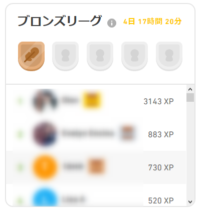

## Duolingoのメリット

語学は継続だと言われますが、継続するための仕掛けが盛り込まれています。

まずはリンゴットです。継続すればするほどリンゴットはもらえます。リンゴットが増える楽しみがあります。レッスンを忘れてしまって継続記録が途絶えないようなアイテムがあり、モチベーションの低下を防いでくれます。

ランキングシステムもその一つです。自分が競う相手も可視化されていますのでモチベーションを保ちやすいです。

また、「フォーラム」と呼ばれるコミュニティがあります。世界中のDuolingoユーザーと会話ができます。同志の存在は励みになります。

この他にもある条件をクリアーすると勲章をもらえます。勲章収集も励みになりますね。

## Duolingoのデメリット

英語学習において継続は大事ですし、Duolingoを続ける上でデメリットはないように思います。

ただ、私はDuolingoの英語の無料レッスンは一通り終了しているのですが、Duolingoだけで英文法を網羅しているとか、英単語数が足りるということはないように思いました。ですから、Duolingoだけをやっていても英語力は頭打ちになると思います。他の英語学習との併用が求められます。

## Duolingoレビュー

デメリットでもお話しましたが、Duolingoだけである程度の英語力が身につくような仕組みにしてほしいなと感じます。

基礎的なことを継続して反復することに意味があることは理解できますが、もう少し単語数や英文法の網羅性を取り入れてくれてもいいように思います。

また、Duolingo内通貨「リンゴット」は、使うところがないために貯まっていくだけです。せっかくのシステムなのですから、もう少し新しい使い方が増えてほしいです。

Duolingoの仕組み自体はとても敷居の低いもので誰もが始められます。日本人にとっての英語のようにある程度の知識があるものよりも、全く知らない言語学習に威力を発揮するのではないかと思います。

## あとがき

今回は、言語学習サービス「Duolingo」のご紹介と簡単な進め方をご説明させていただきました。

英語学習に興味がある方は一度やってみてください！　ホームページからでもスマホアプリからでも利用可能です。

Duolingoでは、マイクを使用したレッスンもありますが、私が使用したことがありませんので、記事の中では触れていません。この点についても興味を持たれた方がいらっしゃいましたら、ぜひDuolingoを試してみてください。

- Duolingo ([https://www.duolingo.com](https://www.duolingo.com))
- Duolingoアプリ(Android) ([https://play.google.com/store/apps/details?id=com.duolingo&hl=ja](https://play.google.com/store/apps/details?id=com.duolingo&hl=ja))
- Duolingoアプリ(iPhone) ([Duolingo](https://apps.apple.com/jp/app/duolingo%E3%81%A7%E8%8B%B1%E4%BC%9A%E8%A9%B1-%E3%83%AA%E3%82%B9%E3%83%8B%E3%83%B3%E3%82%B0%E3%82%84%E4%BC%9A%E8%A9%B1%E3%81%AE%E7%B7%B4%E7%BF%92/id570060128))

以上です。読んでいただきありがとうございました。
