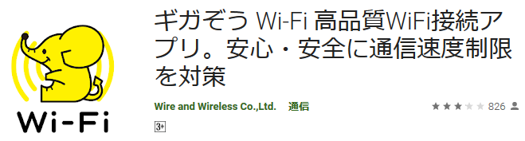
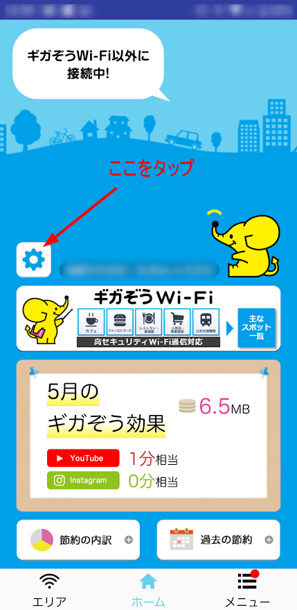
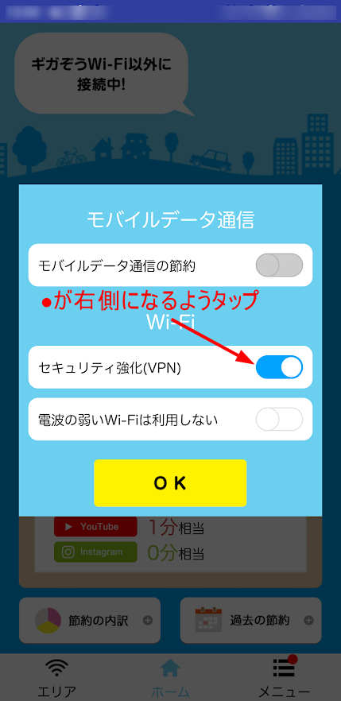

こんにちは！ まなびシステム（ [@manabisystem](https://twitter.com/manabisystem/) ）です。

今回は、公衆Wi-Fiサービス「ギガぞうWi-Fi」をご利用向けに、サービスをちゃんと利用するポイントと問題のある場合の対処法についてご説明いたします。

目次
- [「ギガぞうWi-Fi」とは？](#「ギガぞうWi-Fi」とは？)
- [「ギガぞうWi-Fi」を利用する上で確認すべきポイント](#「ギガぞうWi-Fi」を利用する上で確認すべきポイント)
- [鍵マーク（またはVPNマーク）が表示されない時の対処法](#鍵マーク（またはVPNマーク）が表示されない時の対処法)
- [マナビシステムのトラブル体験談](#マナビシステムのトラブル体験談)
- [あとがき](#あとがき)

## 「ギガぞうWi-Fi」とは？

「ギガぞうWi-Fi」とは、有料公衆無線LANサービスと無料の公衆無線LANサービスを安全に使うためのサービスです。

カフェやコンビニなどに設置されている無料の公衆無線LANサービスは安全上問題があるので、ギガぞうのようなサービスへの加入は必須です。

「ギガぞうWi-Fi」については、関連記事をご覧ください。
- [月額182円のサービスでスマホ代を節約しちゃおう！](https://manabisystem.com/2020-06-01-about-gigazo/)

## 「ギガぞうWi-Fi」を利用する上で確認するポイント

「ギガぞうWi-Fi」を使う際に、スマホ画面の上部（ステータスバー）に鍵のマークやVPNと書かれたマークがあるのをご存でしょうか？

### ギガぞうアプリのVPN設定を確認

ここではギガぞうWi-Fiのアプリを導入済みという前提で、設定の確認方法をご説明いたします。

ギガぞうアプリを起動して、左の歯車マークをタップしてください。

「セキュリティ強化(VPN)」のマルのマークが右側（ブルーになる）に来るようにタップしてください。そして、必ず「OK」をタップしてください。

### ステータスバーの表示を確認

「ギガぞうWi-Fi」のサービス提供スポットや無料公衆無線LANに接続すると、自動的に鍵マーク（VPNマーク）がステータスバー（スマホ画面の上部）に表示されます。

もしこれらのマークが表示されていない場合、公衆無線LANサービスを安全に利用することができません。「ギガぞうWi-Fi」のサービスを十分に利用できていません。

また、無線LANサービスの電波の受信状態が悪いと何度も接続を試みてしまい、マークが表示されたり表示されなかったりします。この場合も「ギガぞうWi-Fi」のサービスを十分に利用できていません。

## 鍵マーク（またはVPNマーク）が表示されない時の対処法

### 1.電波状態のいいところに移動する

カフェなどにいる場合は、その店の中を移動して電波状態のいい場所を探してください。これだけでマークが表示されて解決する場合もあります。

### 2.スマホの再起動

スマホを再起動することで解決する場合があります。

### 3.スマホのWi-Fi設定画面ですべてのネットワークを削除する

iOS系スマホ(アイフォンなど)の場合は、以下のページの手順に従ってください。

- [iPhone、iPad、iPod touch、Mac で Wi-Fi ネットワークの設定を削除する方法](https://support.apple.com/ja-jp/HT208941)

アンドロイド系スマホの場合は、以下のページの手順に従ってください。

- [「以前のWi-Fi情報を削除してください」が表示される【Android】](https://wi2.co.jp/jp/3773/)

### 4.ギガぞうアプリの削除（アンインストール）と再導入（再インストール）

ギガぞうアプリの削除をしてください。

iOS系端末（アイフォンなど）の場合は、プロファイルの削除も同時に行ってください。

- [iPhoneで構成プロファイルをインストールする/削除する](https://support.apple.com/ja-jp/guide/iphone/iph6c493b19/ios)

削除後は、一度端末の再起動をして、もう一度ギガぞうアプリをインストールしてください。

### 5.ギガぞうアプリと競合するアプリの設定変更や削除

ギガぞうアプリは、VPN系アプリ、Wi-Fi自動接続アプリ、セキュリティ系アプリと干渉する可能性があるようです。こうしたアプリを可能であれば設定変更したり削除することで対処できる場合があるのかもしれません。

## マナビシステムのトラブル体験談

私もこのトラブルに見舞われました。結論から申しますと、ギガぞうアプリの再インストールまでの手順で解決することができました。私はアンドロイド系スマホの利用者です。

ギガぞうアプリを使い始めた当初は鍵のマークが表示されていたのですが、ある時から表示されなくなってしまいました。ギガぞうアプリ内での設定ではVPNが有効になっている設定にも関わらず、鍵のマークが表示されないことを不審に思ったのが始まりです。

解決した理由は明確にわからないので推測ですが、ギガぞうアプリを利用するようになってからいろいろなアプリを導入したことで設定などが上書きされてしまったのかもしれません。

## あとがき

ギガぞうWi-Fiを契約しアプリを導入すれば安全…というわけではありません。むしろ鍵マークやVPNマークがなければ安全を放棄しているので全く意味がないとも言えます。

今回は、「『ギガぞうWi-Fi』の設定確認と問題のある場合の対処法についてご説明いたしました。

現在ギガぞうWi-Fiを利用されている方、これから導入を検討されている方も含めて、このポイントについて確認していただけることを願ってやみません。

- [ギガぞうWi-Fi](https://wi2.co.jp/jp/personal/gigazo/)

以上です。読んでいただきありがとうございました。
