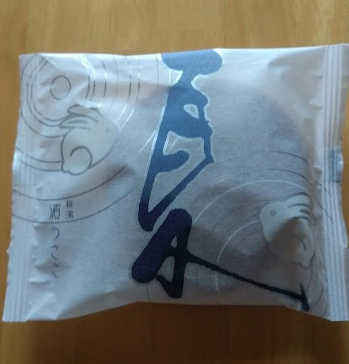
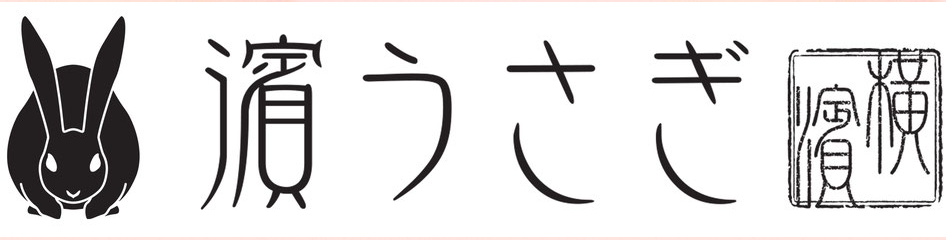
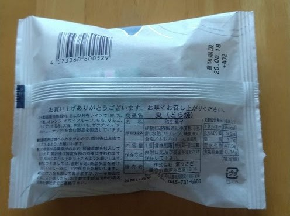
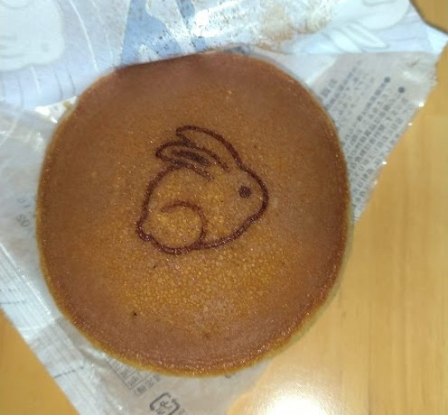

こんにちは！ まなびシステム（ [@manabisystem](https://twitter.com/manabisystem/) ）です。

今日は、横浜の和菓子店「濱うさぎ」さんの夏（どら焼）の食レポをいたします。

## 店舗情報

横浜を拠点に15店舗を展開する創作和菓子店です。

創業は昭和元年と古く、平成10年に株式会社濱うさぎを設立されています。これまで着実に店舗数を増やしています。公式サイトでの通信販売はしていないようです。

価格帯は、100円台～300円台です。陳列の仕方がガラスケースの中に入っているというだけでなく、見栄えのする陳列が印象的です。
水ようかんが竹筒のような容器に入っていておしゃれな印象でした。

## 夏（どら焼）レビュー

### 値段

お値段は170円(税別)です。

### 賞味期限

賞味期限は購入日より8日後までの商品でした。

### 包装

外側は和紙風で内側はビニール製になっています。しっかりした包装がされていてしっかり日持ちがしそうです。

### サイズ

どら焼きのサイズですが、パッケージが四角いので大きく感じましたが、私がこれまで食べたことのあるどら焼きと変わらない一般的なサイズという印象です。

### 味など

カステラは少し湿り気があり、どら焼きを持つと手がベタつきます。その分、カステラがしっとりしていますので、食べてもむせることはありません。

カステラと餡のバランスですが、少しカステラが多いような印象を受けました。しかし、このバランスがほどよい甘さを作り出しているとも言えます。

小倉餡は甘さ控えめで口残りもありません。小豆の皮も硬すぎずにほどよい食感です。

## あとがき

私は夏という商品に合わせて冷やしてから食べました。またぜひ食べたい商品です。

濱うさぎの店舗については公式サイトをご覧ください。
- 

以上です。読んでいただきありがとうございました。
