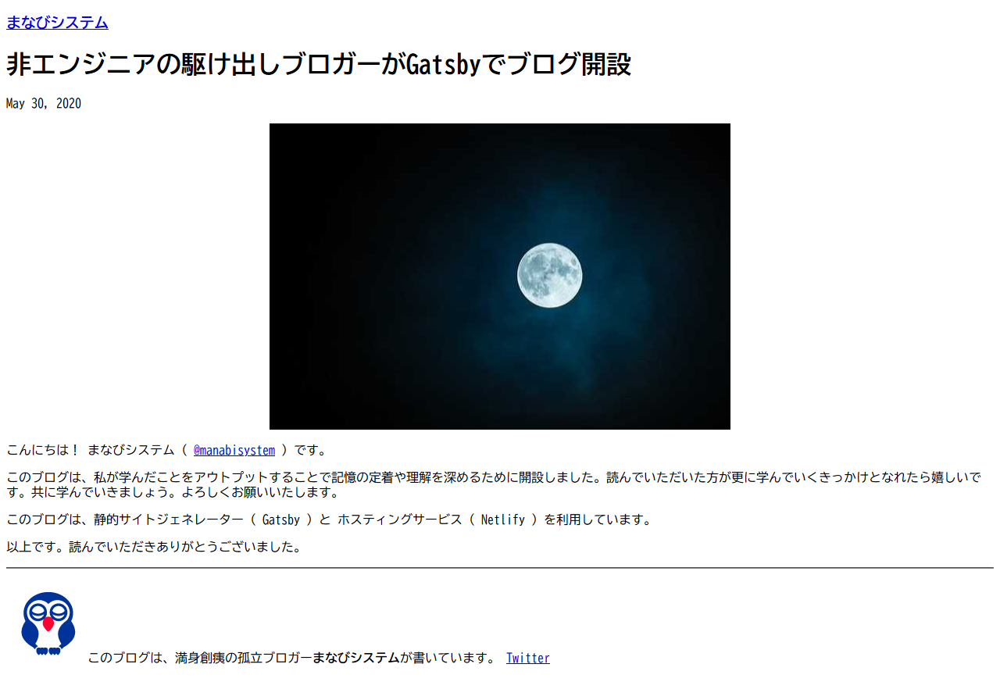

こんにちは！ まなびシステム（ [@manabisystem](https://twitter.com/manabisystem/) ）です。

この記事では、非エンジニアのブロガーがGatsbyでブログ開設するにあたってその経緯と理由についてご説明いたします。

## 私のこれまでのサイト経験

私のこれまでのサイト経験を簡単にご説明いたします。

- 無料ブログサービス（はてな・アメーバ・ライブドアなど）の運営
- Wordpressの設置・運営
- HTML/CSSによるサイト制作・運営

## ブログ開設の条件

どのようにブログを開設するか、この一ヶ月ほど悩みながらいろいろと試して静的サイトジェネレーター（Gatsby）でのブログ開設を選択しました。

私が開設の条件としていたのは以下です。

1. 広告なし
2. 無料で始める
3. 収益を得る
4. 独自ドメインが使える

1番は、3番の条件のためにもどうしても外すことができません。2番は、今までブログ運営の挫折経験があるので、できれば無料で始めたいという思いがあります。3番は、現状では考えられませんが、そうなったらいいなという願望です。学びのためのアウトプットが目的ですが、数値化することでモチベーションにもなりますね。4番は、ずっと自分のブログを残したいという思いがあるからです。無料でまともな独自ドメインを取得することは不可能なので2番と矛盾してしまいますが、無料のブログサービスはいつ終了してしまうかわかりません。

## Wordpress（ワードプレス）が現実的な選択肢

この条件を満たすのは、Wordpressで無料ホスティングサービスを利用することだったのですが、実際にしばらくそうしたサービスで運営してみてその動作の遅さや頻繁に起こる接続エラーに運営していくのは難しいなと思いました。

こうした中で月に200円前後のホスティングサービスとWordpressが現実的な選択肢でした。Wordpressの設定などはすでに完了済みで利用できるので、後はテーマやプラグインをいくつかいれればすぐにでも始められます。

## 静的サイトジェネレーター

しかし、どうしても費用をおさえたいと思う中で、「静的サイトジェンレーター」というものを知りました。簡単に言いますと、原理はどうあれブログサービスやWordpressより動作が速いです。ただし、ブログに比べて投稿作業が手間になることとブログ以上にPCの知識が必要になります。静的サイトジェネレーターについてはあらためて記事にしたいと思います。静的サイトジェネレーターとWordpressのどちらを選択するかはとても重要だからです。

この静的サイトジェネレーターですが、条件付きで広告なし無料でホスティングしてくれるサービスがあります。条件付きというのはくせ者ですが、個人が使う分には当面問題がないレベルであるようです。

## GatsbyとHugo

静的サイトジェネレーターと呼ばれるソフトウェアはたくさんあります。実際に活発に利用されているものは限られているようです。それぞれ特徴があるようですが、非エンジニアの私にはわかりませんでした。その中でHugoとGatsbyを実際にPCに設定して動作確認してみました。

Hugoについては、HTML/CSSとPC環境にソフトウェアをインストールする知識があればつまずくポイントは少ないように思います。その代わりできることもシンプルです。

Gatsbyについては、とにかく難解です！　「Javascript」というプログラム言語を知らないと茨の道ですね。これまでのHTML/CSSの知識も役に立ちますが、付属のようなものの感じがします。

## Gatsbyを選んだ理由

なぜGatsbyを選んだのか、1つは表示速度が速いこと、もう1つはJavascriptを理解していきたいと思ったからです。制作者には作業上のデメリットはあるものの、見ていただける方にとってはメリットしかないと思いました。

表示速度は繰り返しになりますが、爆速だと思います。これは見る側にとっては心地よいものとなるはずです。

Javascriptはプログラム言語なので、理解するのは大変だとは感じています。HTML/CSSとは全く別物ですし、私の現状では設定の変更もままならないですね。しかしあえてそういう場に身を置くことで学びが広がればいいなと思っています。

## 今日のまなび

お金を出せば、有料ホスティングサービスとWordpressで相当の時間を節約できます。ブロガーであるなら必要でないところに労力を割かずに記事の一つでも書いたほうがいいでしょう。しかし、「学び」という点では試行錯誤もまたブログのネタになるかなと思いました。がんばります。
