こんにちは！ まなびシステム（ [@manabisystem](https://twitter.com/manabisystem/) ）です。

この記事では、管理者権限で実行したいソフトウェアをWindows 10の起動時に自動で実行する方法についてご説明いたします。

## ショートカットファイルのプロパティの設定では自動起動できない

一般ユーザーが常に管理者権限でソフトウェアを起動したい場合、そのソフトウェアのショートカットファイルのプロパティで[ショートカットタブ]→[詳細設定]→[管理者として実行]に設定しておけば管理者権限で起動できます。しかし、Windows起動時やログイン時に、スタートアップフォルダにこうしたショートカットファイルを保存しても起動しません。エラーも何も出ません。ただ起動しないだけです。

スタートアップフォルダとは、Windows起動時やログイン時に起動したいソフトウェアを設定するフォルダです。以下の方法で確認することができます。

[Windowsキー]→[Rキー]を押して、「shell:startup」と入力してください。

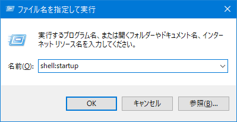

そうするとエクスプローラーが起動して、スタートアップフォルダが開きます。この場所に起動したいソフトウェアのショートカットファイルを保存すると、次回のWindows起動時やログイン時にそのソフトウェアが起動します。

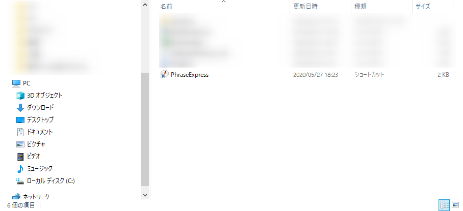

## タスクスケジューラーを使う

では管理者権限で実行するにはどうすればいいでしょうか。タスクスケジューラーを使います。

### 起動

管理者権限で自動起動するには、タスクスケジューラーを使用します。

[Windowsキー]+[Sキー]を押して、検索窓に「タスク」と入力してください。

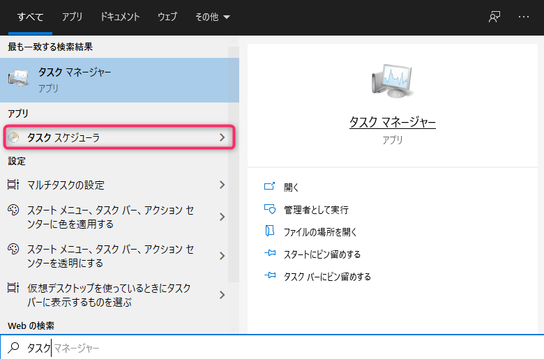

「タスクスケジューラー」をクリックするとタスクスケジューラーが起動します。

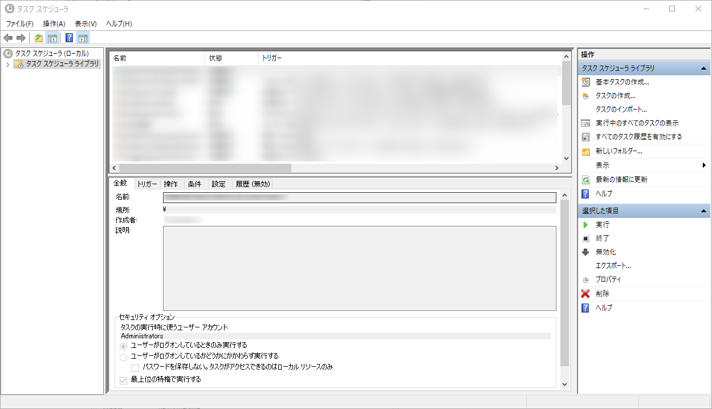

### タスクの作成

タスクスケジューラーの右上の「タスクの作成」をクリックしてください。

#### 全般

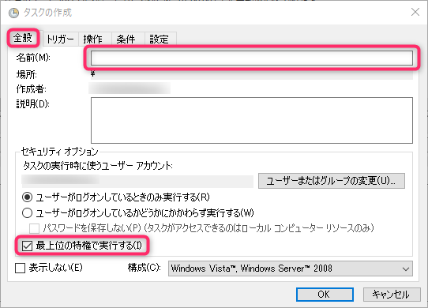

「全般」タブをクリックして、名前の項目に起動したいソフトウェア名を入れてください。

そして、「最上位の特権で実行する」をクリックしてチェックを入れます。

#### トリガー

「トリガー」タブをクリックして、「新規」ボタンをクリックします。

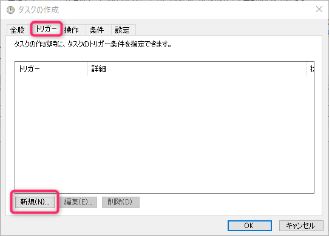

#### 操作

「操作」タブをクリックして、「新規」ボタンを押してください。

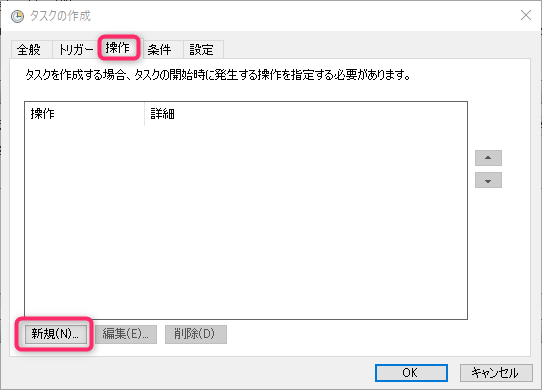

操作の項目に「プログラムの開始」を選択し、「参照」ボタンを押してソフトウェアがあるフォルダの場所を指定します。

#### 条件

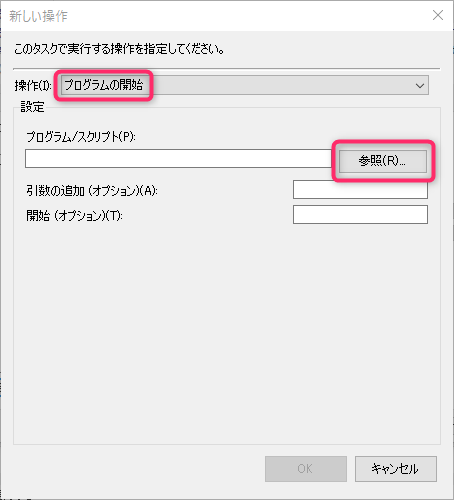

「条件」タブをクリックして、「コンピューターをAC電源で使用している場合のみタスクを開始する」のチェックを外します。

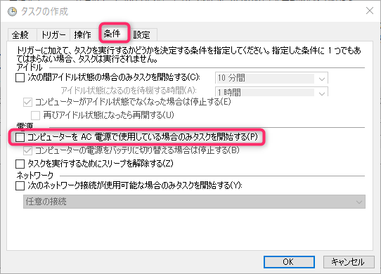

#### 設定

「設定」タブをクリックして、「タスクが失敗した場合の再起動の間隔」をクリックしてチェックをつけます。

最後に右下の「OK」ボタンをクリックしてください。

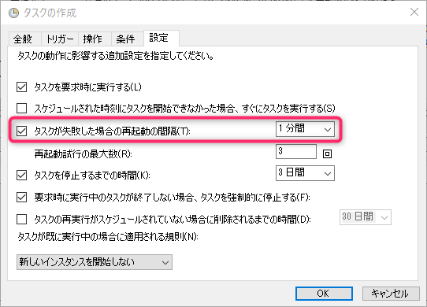

タスクスケジューラーの中央に名前をつけた項目があればタスクの作成できています（ここでは例として「PhraseExpress」という名前になっています）。できていない場合は、Windowsを起動しても自動起動されませんので、再度設定をご確認ください。

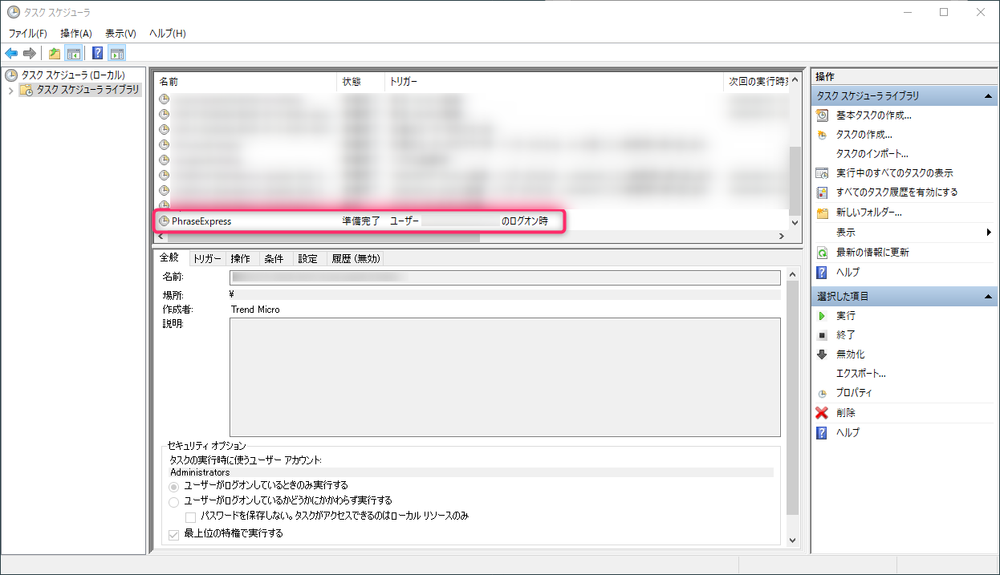

一度、Windowsを終了するなり、再起動してみてください。ソフトウェアが起動しているはずです。

以上です。読んでいただきありがとうございました。

## 今日のまなび

いつも使うソフトウェアというのは案外決まっているもので、自動起動させておくのは便利ですね。しかし管理者権限で実行してしまうということは、セキュリティリスクも高まるということなので慎重に考えたいところです。セキュリティは実際に被害に遭ってみないと意識できないと感じるからです。
